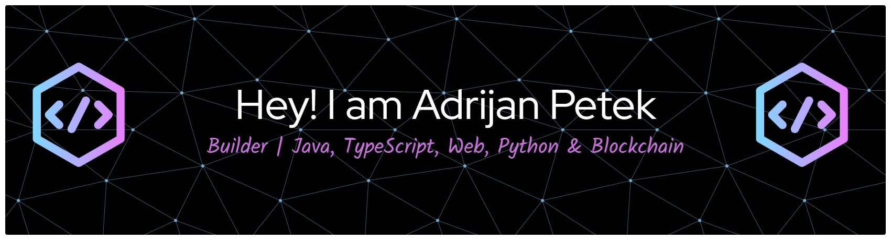

  

  

 

# 👋 Hi, I'm Adrijan Petek

⚡ **Full-Stack Developer & Web3 Explorer**

Experimenting with **Farcaster mini apps** 🌐 and exploring innovative blockchain solutions.  
I document my learning journey in **Python**, **Solidity**, **Web Development**, and **Blockchain projects** across this repository and others 📂 [python-beginners](https://github.com/Adrijan-Petek/python-beginners).  

**🌍 Connect with me:** [X/Twitter](https://x.com/adrijan_petek) • [Zora Badge](https://zora.co/@adrijan) • [Farcaster](https://farcaster.xyz/adrijan)

---
## 📚 Learning & Tutorials

| 🐍 **Python** | 📘 **TypeScript** | 🌐 **Web Dev** | 🔗 **Blockchain** |
|---------------|----------------|-------------|----------------|
| ✅ Basics | ✅ Basics | ✅ HTML & CSS | ✅ Solidity Basics |
| ✅ Files & CSV | ➡️ OOP | ✅ JavaScript | ✅ Ethereum |
| ✅ JSON & APIs | ⏳ Design Patterns | ➡️ React | ✅ Web3 |
| ✅ Error Handling |  | ⏳ Responsive Design | ✅ DApps |
| ➡️ Modules & Imports |  |  | ➡️ NFTs |
| ⏳ Classes & Objects |  |  | ⏳ Smart Contract Security |

✅ = Completed | ➡️ = In Progress | ⏳ = Planned

### 🎯 Current Focus
> **Smart Contract Security** & **Web3 Development**

---

## 🚀 Featured Projects

| Project | Description | Link |
|---------|-------------|------|
| Python Beginners | Step-by-step Python tutorials | [Explore](https://github.com/Adrijan-Petek/python-beginners) |
| Farcaster Mini Apps | Exploring decentralized applications | [Explore](https://farcaster.xyz/adrijan) |
| Joybit | Interactive gaming platform | [Explore](https://joybit.vercel.app/) |
| Mememint | NFT minting platform | [Explore](https://mememint-one.vercel.app/) |
| Super Based Cube | 3D puzzle game on Farcade | [Explore](https://remix.gg/g/18a5445b-b15f-4bf5-a6d6-219c376633a0) |
| BYTE RACERS | Racing game on Farcade | [Explore](https://remix.gg/g/f3da7626-351a-49cc-9fd5-e839018be4bb) |
| Base Defenders | Tower defense game on Farcade | [Explore](https://remix.gg/g/cfa6ed04-a2ec-4a82-866c-268b93774287) |

---

## 💜 Support

If you’d like to support my work, you can buy my Creator Coin on Uniswap (Base).

- [Creator Coin — Buy on Uniswap (Base)](https://app.uniswap.org/swap?outputCurrency=0xf348930442f3afB04F1f1bbE473C5F57De7b26eb&chain=base)

---

## 🛠️ Tech Stack

### Languages & Frameworks
        

## 🌐 Connect With Me

  

## 📈 GitHub Stats

### 📊 GitHub Overview

### 🔥 Contribution Streak

### 📈 Contribution Activity

### 🏆 Achievements & Expertise

<table align="center">
  <tr>
    <td align="center" width="33%">
      
    </td>
    <td align="center" width="33%">
      
    </td>
    <td align="center" width="33%">
      
    </td>
  </tr>
  <tr>
    <td align="center">
      
    </td>
    <td align="center">
      
    </td>
    <td align="center">
      
    </td>
  </tr>
  <tr>
    <td align="center">
      
    </td>
    <td align="center">
      
    </td>
    <td align="center">
      
    </td>
  </tr>
</table>

### 📌 Activity Snapshot

<table align="center">
  <tr>
    <td align="center">
      <h3>💬 Commits</h3>
      
    </td>
    <td align="center">
      <h3>📁 Projects</h3>
      
    </td>
    <td align="center">
      <h3>⭐ Contributions</h3>
      
    </td>
  </tr>
</table>

---

---

⭐️ **Last Updated**: 2026-01-08 19:32:59  
*This README updates daily with new content!* ✨
