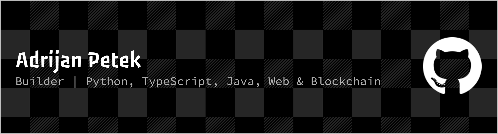

# 👋 Hi, I'm Adrijan Petek  

🚀 **Builder | Full-Stack Developer | Crypto Enthusiast**  
Currently working on [CryptoMobb](https://www.cryptomobb.xyz) and experimenting with Farcaster mini apps 🌐.  
I document my learning journey in Python, Solidity, Web Development, and Blockchain projects in this repository and others 📂 [python-beginners](https://github.com/Adrijan-Petek/python-beginners).  

---

## 🐍 Learning & Tutorials

### **Python**
- ✅ Basics  
- ✅ Files & CSV  
- ✅ JSON & APIs  
- ✅ Error Handling  
- ✅ Modules & Imports  
- ➡️ Next: Classes & Objects, Advanced Python Concepts  

### **TypeScript & Java**
- ✅ TypeScript Basics  
- ✅ Java Fundamentals  
- ➡️ Next: Object-Oriented Programming, Design Patterns  

### **Web Development**
- ✅ HTML & CSS  
- ➡️ Next: JavaScript, React, Responsive Design  

### **Blockchain & Solidity**
- ✅ Solidity Smart Contracts Basics  
- ✅ Ethereum & Web3 Concepts  
- ➡️ Next: DApps, NFTs, Smart Contract Security  

---

## ⚡ About Me
- 🔭 Currently working on: **CryptoMobb** & **Farcaster mini apps**  
- 🌱 Learning: **Python, Solidity, TypeScript, Web Development, VS Code Tips, Blockchain Development**  
- 💬 Ask me about: **Coding tutorials, Crypto projects, Python, Solidity, Web Dev**  
- ⚡ Fun fact: I believe every project gets better with memes 😎  

---

## 🛠️ Tech Stack

---

## 📈 GitHub Stats
  

---

## 🚀 Projects
- [CryptoMobb](https://www.cryptomobb.xyz) – Crypto community and learning platform  
- [Python Beginners](https://github.com/Adrijan-Petek/python-beginners) – Step-by-step Python tutorials  
- [Farcaster Mini Apps](https://farcaster.xyz/adrijan) – Exploring decentralized applications  

---

## 📝 Learning Roadmap
- **Python**: Advanced Python, OOP, Libraries (Pandas, NumPy)  
- **TypeScript & Java**: OOP, Web Services, Backend Development  
- **Web Development**: JavaScript, React, Responsive UI  
- **Blockchain & Solidity**: DApps, NFTs, Smart Contract Security  
- **Dev Tools**: Git, GitHub, VS Code, CLI proficiency  

---

## ✨ Fun Section
  
*"Because every repo deserves a cat 🐾"*  

---

⭐️ From [Adrijan-Petek](https://github.com/Adrijan-Petek)  
